# BUILD_LOG.md

# SOC Automation Lab

## Building an End-to-End Security Operations Center Using Wazuh, Sysmon, Shuffle SOAR, VirusTotal, and TheHive

---

# 1. Project Overview

## Objective

The goal of this project was to build a complete Security Operations Center (SOC) automation environment capable of:

* Collecting endpoint telemetry

* Detecting malicious activity

* Automatically enriching indicators with threat intelligence

* Automatically generating incident tickets

* Automatically notifying analysts

The project was designed to simulate a real-world blue-team environment using open-source security tools and cloud infrastructure.

---

## Final Architecture

Windows 11 Endpoint

↓

Sysmon

↓

Wazuh Agent

↓

Wazuh Manager

↓

Custom Detection Rule

↓

Shuffle SOAR

↓

VirusTotal

↓

TheHive

↓

Analyst Notification

---

## Technologies Used

### Endpoint

* Windows 11 Pro

* Sysmon

* Wazuh Agent

### SIEM

* Wazuh Manager

* Wazuh Indexer

* Wazuh Dashboard

### SOAR

* Shuffle

### Threat Intelligence

* VirusTotal

### Incident Response

* TheHive

### Cloud Platform

* AWS EC2

### Operating Systems

* Windows 11

* Ubuntu Server 24.04 LTS

---

# 2. Environment Preparation

## Host Machine Specifications

The SOC lab was built on a Windows host system using Oracle VirtualBox.

Host System:

* Windows 11

* Intel Core i5 Processor

* 16 GB RAM

* 512 GB NVMe SSD

---

## Why Virtualization?

A SOC analyst must safely generate telemetry without affecting production systems.

Using virtualization provides:

* Isolation

* Safe malware execution

* Snapshot recovery

* Reproducible testing

VirtualBox was chosen because:

* Free

* Lightweight

* Easy networking

* Widely used in home labs

---

# 3. Windows 11 Endpoint Deployment

## Downloading Windows 11 ISO

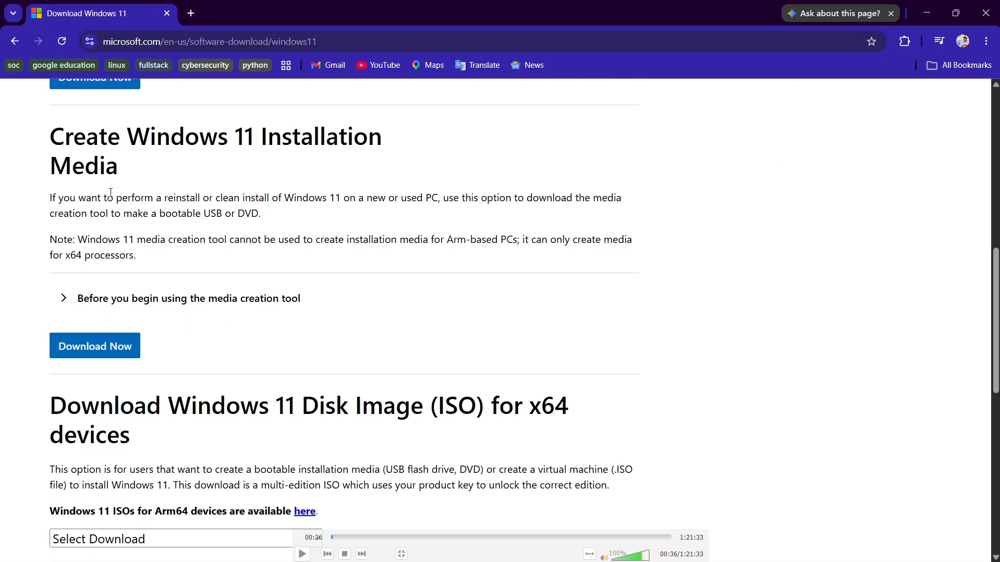

The Windows 11 ISO image was downloaded from Microsoft.

Purpose:

This machine acts as:

* Victim endpoint

* Log generation source

* Attack simulation target

---

## Creating Virtual Machine

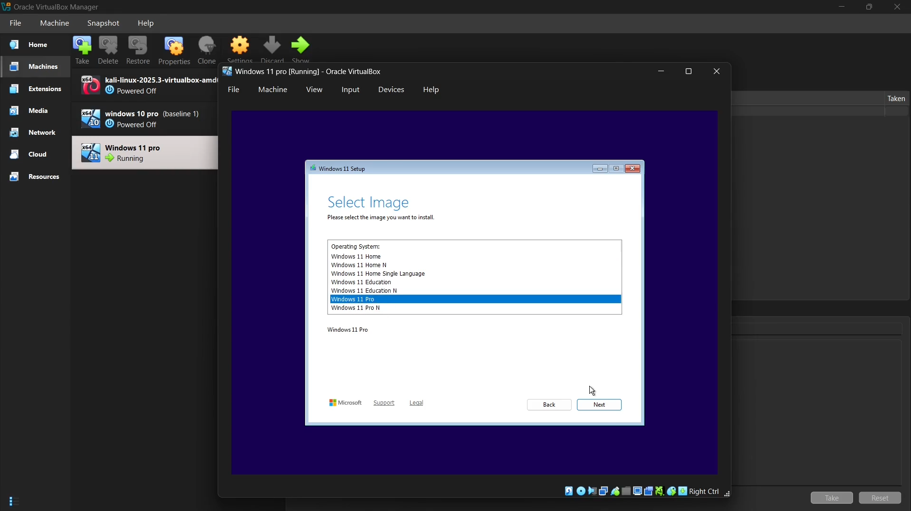

Virtual Machine Name:

Windows-11-Pro

Allocated Resources:

* 8 GB RAM

* 2 vCPU

* 100 GB Virtual Disk

Network Adapter:

* NAT

---

## Initial Configuration

After installation:

* Created local administrator account

* Applied Windows updates

* Disabled unnecessary startup applications

* Installed Guest Additions

Verification:

The endpoint successfully booted and received internet connectivity.

---

# 4. AWS Infrastructure Deployment

## Why AWS?

The objective was to build a realistic SOC environment.

Benefits:

* Public accessibility

* Cloud deployment experience

* Industry relevance

* Scalability

---

## Region Selection

AWS Region:

US East (N. Virginia)

Reason:

* Low latency

* Broad service availability

* Commonly used region

---

# 5. Wazuh Server Deployment

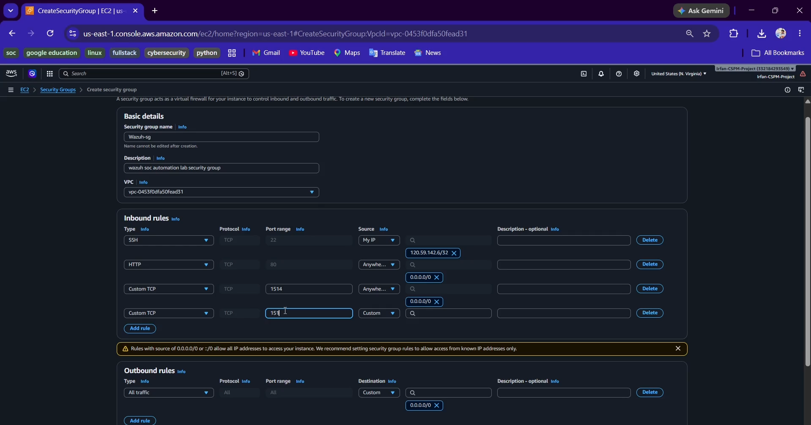

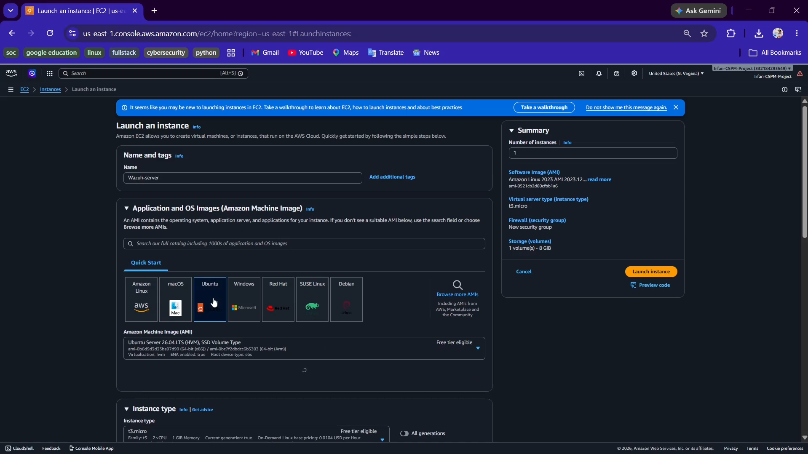

## Instance Creation

Purpose:

Host the SIEM platform.

Instance Configuration:

Instance Name:

Wazuh-Server

Operating System:

Ubuntu Server 24.04 LTS

Instance Type:

m7i-flex.large

Resources:

* 2 vCPU

* 8 GB RAM

* 96 GB Storage

---

## Security Group Configuration

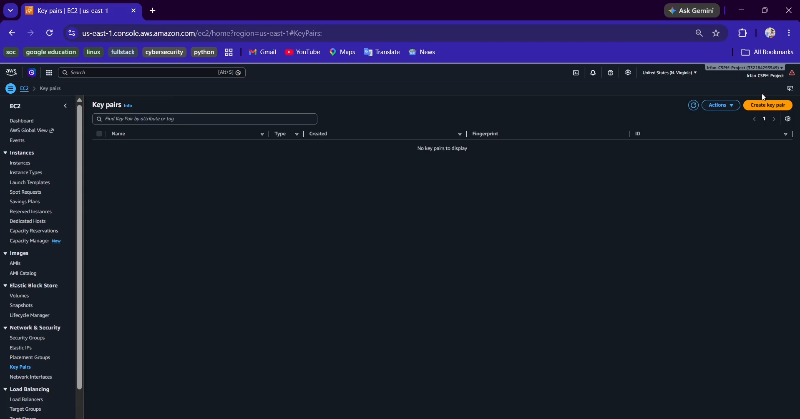

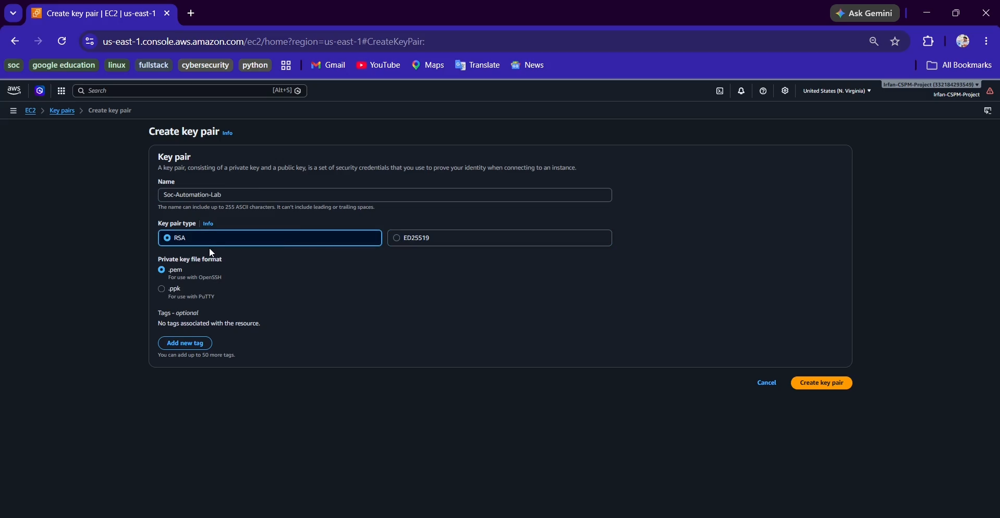

Inbound Rules:

HTTPS:

TCP 443

Source:

0.0.0.0/0

Purpose:

Dashboard access

---

SSH:

TCP 22

Source:

Administrator Public IP

Purpose:

Server administration

---

Agent Communication:

TCP 1514

Source:

0.0.0.0/0

Purpose:

Agent event transmission

---

TCP 1515

Source:

0.0.0.0/0

Purpose:

Agent registration

---

## Initial Server Validation

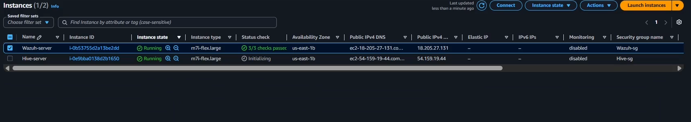

After deployment:

SSH Connection Test:

ssh ubuntu@PUBLIC_IP

Verification:

Successfully connected to the server.

---

# 6. Wazuh Installation

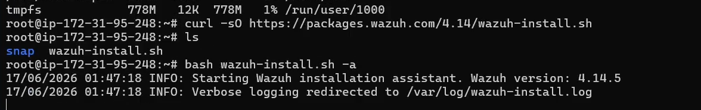

## Installation Method

Official Wazuh all-in-one deployment.

Commands:

curl -sO https://packages.wazuh.com/4.14/wazuh-install.sh

chmod +x wazuh-install.sh

sudo ./wazuh-install.sh -a

---

## Components Installed

The installer deployed:

### Wazuh Manager

Responsible for:

* Event processing

* Rule evaluation

* Alert generation

---

### Wazuh Indexer

Responsible for:

* Storage

* Search

* Analytics

---

### Wazuh Dashboard

Responsible for:

* Visualization

* Discover searches

* Alert monitoring

---

# 7. Post Installation Verification

Verify Dashboard:

https://PUBLIC_IP

Expected Result:

Wazuh login page appears.

---

Verify Manager

systemctl status wazuh-manager

Expected:

active (running)

---

Verify Indexer

systemctl status wazuh-indexer

Expected:

active (running)

---

Verify Dashboard Service

systemctl status wazuh-dashboard

Expected:

active (running)

---

# 8. Wazuh Dashboard Access

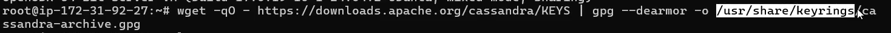

Initial Login

Default Credentials:

admin

Generated Password:

Retrieved from installation output.

---

Verification

Successfully logged into:

Wazuh Dashboard

Observed:

* Dashboard Home

* Security Events

* Discover

* Agent Management

---

# 9. Common AWS Issue Encountered

## Public IP Address Change

Problem:

After stopping and starting EC2 instances, AWS assigned new public IP addresses.

Impact:

* Wazuh Agent disconnected

* Dashboard access interrupted

* Integrations stopped functioning

---

Root Cause

Elastic IPs were not configured.

AWS automatically assigns a new public IP when an instance is restarted.

---

Resolution

Updated:

Windows Agent ossec.conf

Changed:

<address>OLD_IP</address>

To:

<address>NEW_IP</address>

Restarted Agent:

Restart-Service WazuhSvc

Verification:

Agent reconnected successfully.

---

# 10. Windows Endpoint Agent Installation

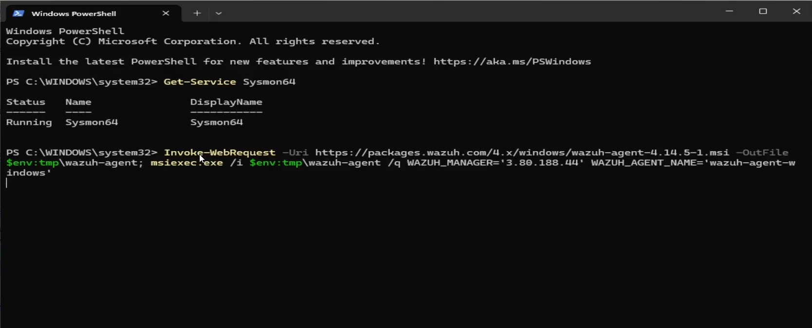

Purpose:

Forward endpoint logs to Wazuh.

Installed:

Wazuh Agent

Version:

Latest compatible version with Wazuh 4.14

---

Configuration File

Location:

C:\\Program Files (x86)\\ossec-agent\\ossec.conf

Manager Address:

<server>

  <address>WAZUH_SERVER_PUBLIC_IP</address>

</server>

---

Service Verification

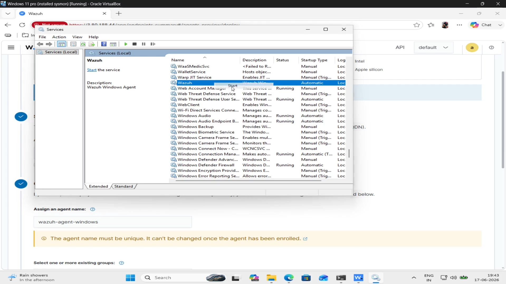

PowerShell:

Get-Service Wazuh*

Expected:

Status:

Running

---

Verification in Dashboard


Wazuh Dashboard

Management → Agents

Observed:

Agent Status:

Active

Connection:

Established

Agent Name:

Windows-11-Pro

The endpoint was now successfully connected to the SIEM platform.


# 11. Sysmon Deployment and Endpoint Telemetry Collection

## Objective

At this stage, the Windows endpoint was successfully connected to the Wazuh Manager.

However, a major limitation still existed.

By default, Windows event logs provide only limited visibility into system activity.

For a SOC analyst, this is insufficient.

We need detailed telemetry such as:

* Process Creation

* Network Connections

* DLL Loads

* Registry Modifications

* Driver Loads

* File Creation Events

* Process Injection Attempts

To achieve this visibility, Microsoft Sysinternals Sysmon was deployed.

---

# 12. Why Sysmon?

Sysmon (System Monitor) is a Windows system service developed by Microsoft Sysinternals.

Unlike standard Windows logging, Sysmon provides:

### Event ID 1

Process Creation

Examples:

* cmd.exe

* powershell.exe

* mimikatz.exe

---

### Event ID 3

Network Connection

Examples:

* ping

* browser traffic

* malware beaconing

---

### Event ID 7

Image Loaded

Examples:

* DLL loading activity

---

### Event ID 10

Process Access

Examples:

* Credential dumping

* Process injection attempts

---

### Event ID 11

File Creation

Examples:

* Malware dropping payloads

---

### Event ID 13

Registry Modification

Examples:

* Persistence mechanisms

---

These events are heavily used in modern SOC environments.

---

# 13. Sysmon Installation

## Downloading Sysmon

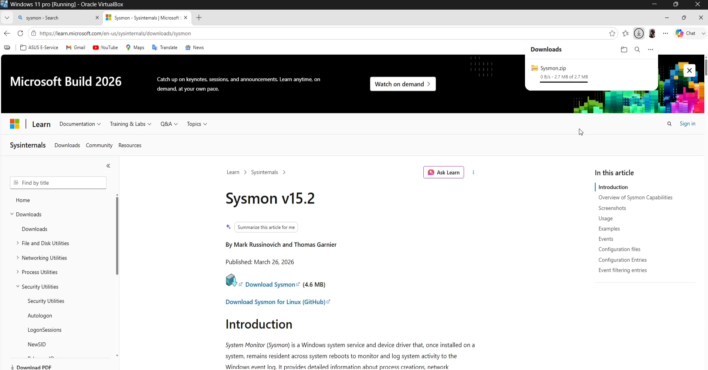

Sysmon was downloaded from:

Microsoft Sysinternals

Files:

* Sysmon64.exe

* Sysmon configuration file

---

# 14. Sysmon Configuration Selection

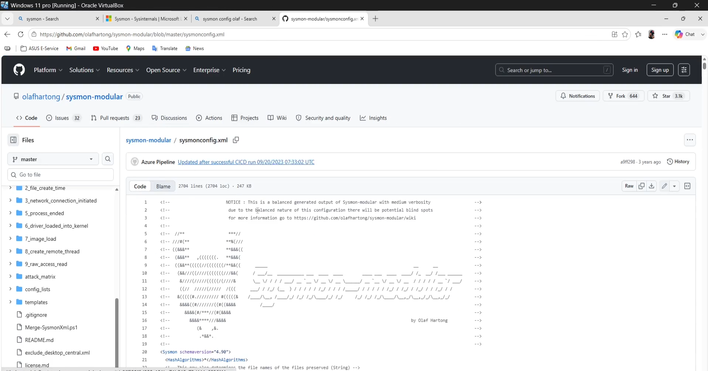

Many public Sysmon configurations exist.

The configuration selected for this project was:

Olaf Hartong Sysmon Configuration

Reason:

* Industry trusted

* MITRE ATT&CK focused

* Reduces noise

* Detects common attack techniques

---

# 15. Sysmon Installation Command

PowerShell (Administrator):

sysmon64.exe -i sysmonconfig.xml

---

Expected Output

Sysmon service installed successfully.

Verification:

Event Viewer

Applications and Services Logs

↓

Microsoft

↓

Windows

↓

Sysmon

↓

Operational

---

Verification Result


Sysmon events immediately began appearing.

Observed:

* Event ID 1

* Event ID 3

* Event ID 7

* Event ID 10

---

# 16. First Major Problem

## Sysmon Events Not Appearing in Wazuh

Symptoms:

* Sysmon operational log contained events

* Event Viewer showed activity

* Wazuh Dashboard showed almost no Sysmon data

Observed:

Only around:

24 events

appeared in Discover.

This was suspiciously low.

Opening:

* Notepad

* Calculator

* CMD

* PowerShell

generated logs inside Event Viewer but not inside Wazuh.

---

# 17. Investigation

To determine whether the issue was:

* Sysmon

* Wazuh Agent

* Wazuh Manager

multiple validation steps were performed.

---

## Verify Sysmon Events Exist

PowerShell:

Get-WinEvent `-LogName Microsoft-Windows-Sysmon/Operational`

-MaxEvents 20

Result:

Events successfully appeared.

This proved:

Sysmon was functioning correctly.

---

## Generate Test Activity

Executed:

whoami

ipconfig

net user

ping 8.8.8.8

Verification:

Events appeared inside Sysmon.

---

Conclusion:

Problem was not Sysmon.

Problem existed between:

Sysmon → Wazuh Agent

or

Wazuh Agent → Wazuh Manager

---

# 18. Inspecting ossec.conf

File:

C:\\Program Files (x86)\\ossec-agent\\ossec.conf

Observed Configuration:

Application

Security

System

were being monitored.

Example:

<localfile>

  <location>Application</location>

  <log_format>eventchannel</log_format>

</localfile>

<localfile>

  <location>Security</location>

  <log_format>eventchannel</log_format>

</localfile>

<localfile>

  <location>System</location>

  <log_format>eventchannel</log_format>

</localfile>

---

Problem:

No Sysmon channel was configured.

---

# 19. Adding Sysmon Collection

Added:

<localfile>

  <location>Microsoft-Windows-Sysmon/Operational</location>

  <log_format>eventchannel</log_format>

</localfile>

---

Restarted Agent

Restart-Service WazuhSvc

---

# 20. Verification

Agent Log:

C:\\Program Files (x86)\\ossec-agent\\ossec.log

Verification Command:

Select-String `-Path "C:\\\\\\\\\\\\\\\\Program Files (x86)\\\\\\\\\\\\\\\\ossec-agent\\\\\\\\\\\\\\\\ossec.log"`

-Pattern "Sysmon"

Observed:

Analyzing event log:

'Microsoft-Windows-Sysmon/Operational'

This confirmed:

The agent was now collecting Sysmon telemetry.

---

# 21. Second Major Problem

## Events Still Missing in Discover

Even after Sysmon collection was enabled:

Expected:

Hundreds of events

Observed:

Very few events

---

This suggested:

Events might be reaching the manager but not appearing in searches.

---

# 22. Enabling Raw Log Archiving

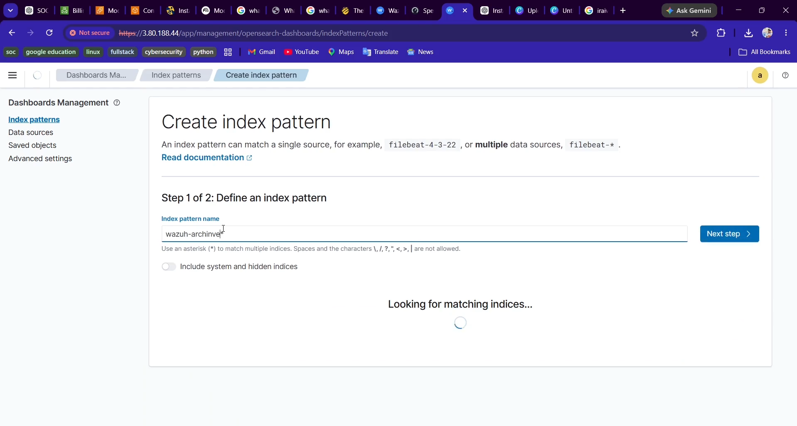

To determine whether the manager received events:

logall

and

logall_json

were enabled.

File:

/var/ossec/etc/ossec.conf

Configuration:

<logall>yes</logall>

<logall_json>yes</logall_json>

---

Restart:

systemctl restart wazuh-manager

---

# 23. Inspecting Raw Events

Command:

tail -f /var/ossec/logs/archives/archives.json

This file contains:

Every event received by Wazuh.

Regardless of whether an alert is generated.

---

# 24. Breakthrough Discovery

After running:

whoami

ipconfig

net user

on the Windows endpoint,

the corresponding events appeared inside:

archives.json

---

This proved:

Windows Endpoint

✓

Sysmon

✓

Wazuh Agent

✓

Network Transmission

✓

Wazuh Manager

✓

All functioning correctly.

---

The issue was no longer ingestion.

The issue was visualization and filtering.

---

# 25. Verifying Sysmon Data Reaches Wazuh

Observed Example Event

Source:

Microsoft-Windows-Sysmon

Event ID:

10

Process Access Event

Fields Observed:

SourceProcessGUID

SourceProcessId

SourceImage

TargetProcessGUID

TargetProcessId

TargetImage

GrantedAccess

CallTrace

SourceUser

TargetUser

---

This confirmed:

Full Sysmon telemetry was successfully arriving at Wazuh.

The collection pipeline was now operational.

---

# 26. Understanding Why Ping Did Not Produce Expected Network Events

During testing:

whoami

ipconfig

net user

generated process creation events.

However:

ping 8.8.8.8

did not immediately generate expected Event ID 3 records.

---

Investigation revealed:

The Olaf Hartong Sysmon configuration intentionally filters significant amounts of noise.

Not every network activity is logged.

Many events are excluded to keep telemetry manageable.

---

Lesson Learned

Seeing fewer events is not necessarily a failure.

A high-quality Sysmon configuration deliberately reduces noise.

More logs does not always mean better visibility.

Relevant logs are more valuable than noisy logs.

---

# 27. Final Result

By the end of this phase:

✓ Sysmon installed

✓ Sysmon operational

✓ Sysmon telemetry collected

✓ Wazuh Agent subscribed

✓ Events reaching manager

✓ Events verified inside archives.json

✓ Endpoint telemetry pipeline operational

This phase established the foundation for detection engineering and custom threat detection.


# 28. Detection Engineering and Mimikatz Detection

## Objective

At this stage, the telemetry pipeline was fully operational.

Windows Endpoint

↓

Sysmon

↓

Wazuh Agent

↓

Wazuh Manager

↓

Wazuh Dashboard

The next objective was to detect a real-world attack technique rather than simply collecting logs.

---

## Why Mimikatz?

Mimikatz is one of the most well-known post-exploitation tools used by attackers.

Capabilities include:

* Credential Dumping

* Kerberos Ticket Extraction

* Pass-the-Hash Attacks

* Pass-the-Ticket Attacks

* Privilege Escalation

Because of its popularity among adversaries, detecting Mimikatz execution is considered a foundational SOC detection use case.

---

## MITRE ATT&CK Mapping

Technique:

T1003

Credential Dumping

Tactic:

Credential Access

Detection Source:

Sysmon Process Creation Events

---

# 29. Generating Test Telemetry

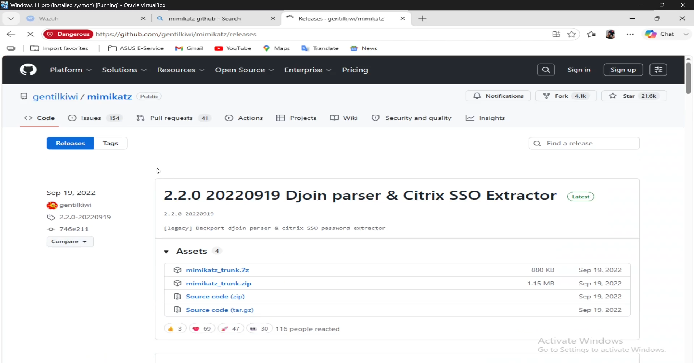

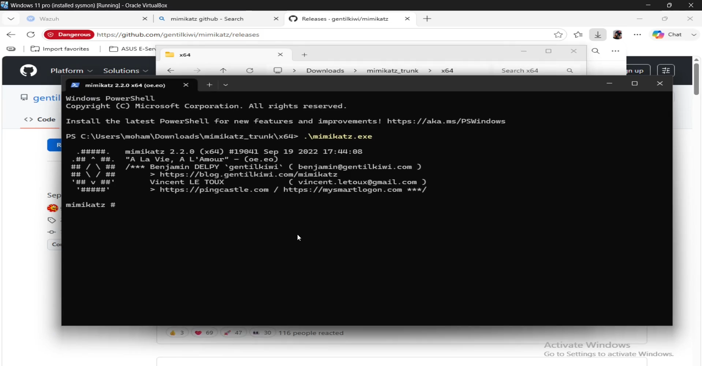

The objective was to create a controlled attack simulation.

The following file was executed:

mimikatz.exe

on the Windows 11 endpoint.

---

Expected Result

Sysmon Event ID 1

↓

Wazuh Event Collection

↓

Custom Rule Match

↓

Wazuh Alert

---

# 30. Initial Detection Failure

Despite executing:

mimikatz.exe

No custom alert appeared.

---

Symptoms

Sysmon Events:

✓ Present

Wazuh Events:

✓ Present

Custom Detection Alert:

✗ Missing

---

Investigation began.

---

# 31. Event Analysis

The raw event was examined.

Important Sysmon fields were identified.

Example Fields:

Image

OriginalFileName

CommandLine

ParentImage

Hashes

ProcessGuid

---

Key Observation

The field:

win.eventdata.originalFileName

contained:

mimikatz.exe

This field was selected as the detection target.

---

# 32. Creating a Custom Detection Rule

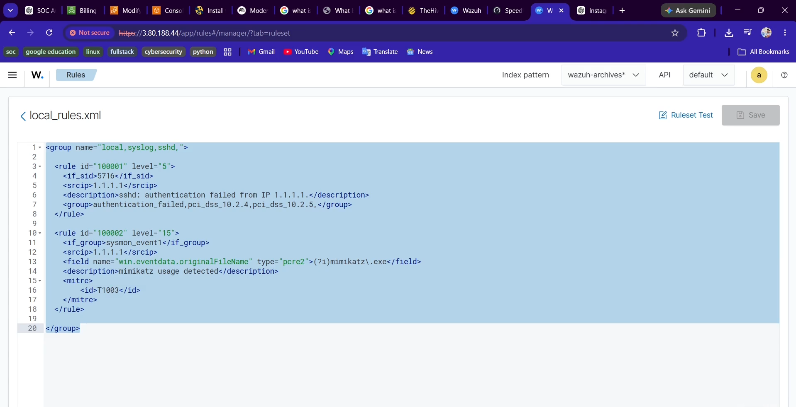

File:

/var/ossec/etc/rules/local_rules.xml

Custom Rule:

<rule id="100002" level="15">

```

<if\\\\\\\\\\\\\\\\\\\\\\\\\\\\\\_group>sysmon\\\\\\\\\\\\\\\\\\\\\\\\\\\\\\_event1</if\\\\\\\\\\\\\\\\\\\\\\\\\\\\\\_group>

<field name="win.eventdata.originalFileName"

\\\\\\\\\\\\\\\       type="pcre2">

\\\\\\\\\\\\\\\       (?i)mimikatz\\\\\\\\\\\\\\\\\\\\\\\\\\\\\\\.exe

</field>

<description>

\\\\\\\\\\\\\\\    Mimikatz usage detected

</description>

<mitre>

\\\\\\\\\\\\\\\    <id>T1003</id>

</mitre>

```

</rule>

---

# 33. Rule Explanation

Rule ID:

100002

Purpose:

Detect Mimikatz execution.

---

Level:

15

Purpose:

High severity detection.

Reason:

Mimikatz execution is strongly associated with malicious activity.

---

if_group

sysmon_event1

Purpose:

Only evaluate Sysmon Process Creation events.

Avoids unnecessary processing.

---

Regex

(?i)mimikatz.exe

Purpose:

Case-insensitive matching.

Matches:

mimikatz.exe

Mimikatz.exe

MIMIKATZ.EXE

---

MITRE Mapping

T1003

Credential Dumping

---

# 34. Applying the Rule

After saving:

local_rules.xml

the manager was restarted.

Command:

systemctl restart wazuh-manager

---

Verification:

systemctl status wazuh-manager

Expected:

active (running)

---

# 35. Successful Detection


The executable was launched again.

mimikatz.exe

---

Result

Wazuh generated a new alert.

Observed:

Rule ID:

100002

Description:

Mimikatz usage detected

Severity:

15

MITRE Technique:

T1003

---

This represented the first successful custom detection engineered within the SOC environment.

---

# 36. Detection Validation

Verification was performed in:

Wazuh Dashboard

↓

Security Events

↓

Discover

---

Searches Used

rule.id:100002

---

Alternative Search

mimikatz

---

Observed Fields

Agent Name

Hostname

Rule Description

Rule ID

Timestamp

Sysmon Metadata

MITRE ATT&CK Mapping

---

The detection pipeline was now operational.

---

# 37. Preparing for Automation

At this stage:

Detection existed.

However:

The analyst still needed to manually:

* Review alerts

* Investigate indicators

* Create tickets

* Notify responders

This process was inefficient.

The next goal was automation.

---

# 38. Introducing SOAR

SOAR

Security Orchestration Automation and Response

Purpose:

Reduce analyst workload.

Automate repetitive security tasks.

---

Chosen Platform

Shuffle

Reason:

* Open-source

* Cloud hosted

* Easy integrations

* Visual workflow builder

* Supports Wazuh

* Supports VirusTotal

* Supports TheHive

---

# 39. Creating a Shuffle Account

Platform:

Shuffle.io

Actions:

Created account

↓

Logged in

↓

Accessed Workflows

---

# 40. Creating the SOC Workflow

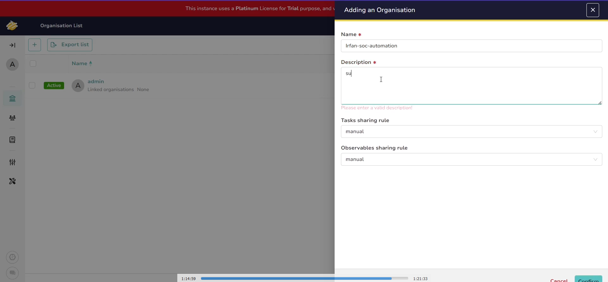

New Workflow Created

Name:

SOC Automation Project

Purpose:

Automatically process Wazuh detections.

---

Initial Workflow Design

Webhook

↓

Regex Extraction

↓

VirusTotal

↓

TheHive

↓

Email Notification

---

# 41. Creating the Webhook

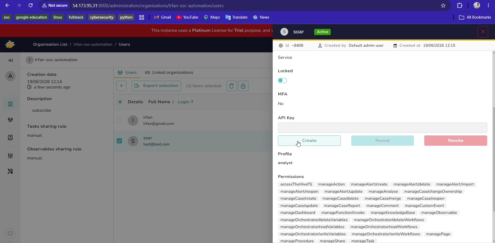

Within Shuffle:

Webhook App

↓

Drag to Canvas

↓

Generate Webhook URL

---

Example

https://shuffler.io/api/v1/hooks/xxxxxxxx

---

Purpose

Receive alerts directly from Wazuh.

---

# 42. Integrating Wazuh with Shuffle

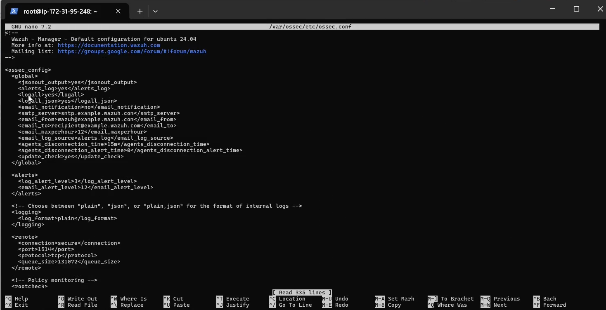

The next step was enabling Wazuh to send alerts to the Shuffle webhook.

File:

/var/ossec/etc/ossec.conf

---

Added Configuration

<integration>

```

<name>shuffle</name>

<hook\\\\\\\\\\\\\\\\\\\\\\\\\\\\\\_url>

https://shuffler.io/api/v1/hooks/WEBHOOK\\\\\\\\\\\\\\\\\\\\\\\\\\\\\\_ID

</hook\\\\\\\\\\\\\\\\\\\\\\\\\\\\\\_url>

<rule\\\\\\\\\\\\\\\\\\\\\\\\\\\\\\_id>100002</rule\\\\\\\\\\\\\\\\\\\\\\\\\\\\\\_id>

<alert\\\\\\\\\\\\\\\\\\\\\\\\\\\\\\_format>json</alert\\\\\\\\\\\\\\\\\\\\\\\\\\\\\\_format>

```

</integration>

---

# 43. Understanding the Integration

name

shuffle

Uses Wazuh's Shuffle integration.

---

hook_url

Destination endpoint.

Provided by Shuffle.

---

rule_id

100002

Purpose:

Forward only Mimikatz detections.

Reduces noise.

---

alert_format

json

Required by Shuffle.

Allows structured processing.

---

# 44. Applying Integration Changes

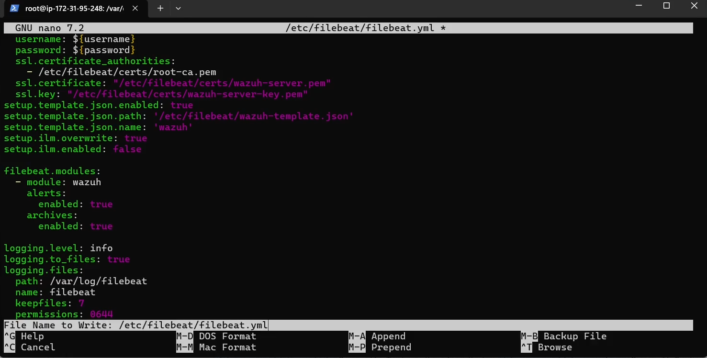

Restart Manager

systemctl restart wazuh-manager

---

Verification

systemctl status wazuh-manager

Expected:

active (running)

---

# 45. Testing the Integration

Executed:

mimikatz.exe

again.

---

Expected Flow

Windows Endpoint

↓

Sysmon

↓

Wazuh Agent

↓

Wazuh Manager

↓

Rule 100002

↓

Shuffle Webhook

---

# 46. Successful Webhook Trigger

Within Shuffle:

Explore Runs

↓

New execution appeared

---

Observed Data

Rule Information

Agent Information

Hostname

Timestamp

Alert ID

MITRE Technique

Event Metadata

Hashes

Process Information

---

This confirmed:

✓ Detection Working

✓ Integration Working

✓ Alert Delivery Working

✓ SOAR Pipeline Working

---

# 47. First End-to-End SOC Success

At this stage the environment could:

Detect Mimikatz

↓

Generate Alert

↓

Send Alert

↓

Trigger SOAR Workflow

without analyst intervention.

This marked the transition from a traditional SIEM deployment into an automated SOC architecture.

The next phase focuses on extracting file hashes from Sysmon telemetry, enriching them using VirusTotal, and automatically generating incident tickets inside TheHive.


# 48. Threat Intelligence Enrichment and Automated Incident Response


## Objective

At this stage, the SOC environment could:

✓ Collect endpoint telemetry

✓ Detect Mimikatz execution

✓ Generate Wazuh alerts

✓ Forward alerts to Shuffle

However, the workflow still lacked automated investigation capabilities.

The next objective was to:

1. Extract Indicators of Compromise (IOCs)

2. Query VirusTotal automatically

3. Create incidents automatically

4. Notify analysts automatically

This transforms the SOC from a detection platform into a response platform.

---

# 49. Understanding the Incoming Wazuh Alert

When Mimikatz was executed:

Windows 11 Endpoint

↓

Sysmon Event ID 1

↓

Wazuh Custom Rule 100002

↓

Shuffle Webhook

The webhook received a large JSON object.

The alert contained:

* Rule Information

* Host Information

* Process Metadata

* Command Line Data

* Hashes

* MITRE ATT&CK Information

---

Example Fields

rule.id

rule.description

agent.name

agent.id

timestamp

win.eventdata.image

win.eventdata.commandLine

win.eventdata.hashes

---

# 50. Challenge: Extracting the Malware Hash

The VirusTotal API requires a file hash.

However:

The Wazuh alert contains the hash embedded inside a long text string.

Example:

MD5=xxxx,

SHA1=xxxx,

SHA256=61C0810A23580CF492A6BA4F7654566108331E7A4134C968C2D6A05261B2D8A1

The workflow needed a way to isolate:

SHA256

from the larger string.

---

# 51. Adding Shuffle Tools

A new node was added.

Application:

Shuffle Tools

Action:

Regex Capture Group

Purpose:

Extract SHA256 value.

---

Workflow Updated

Webhook

↓

Regex Capture Group

↓

VirusTotal

---

# 52. Regex Design

The SHA256 hash always contains:

64 hexadecimal characters

The following regular expression was used:

SHA256=(\[A-Fa-f0-9]{64})

---

Explanation

SHA256=

Locate the SHA256 label.

---

(\[A-Fa-f0-9]{64})

Capture exactly:

64 hexadecimal characters.

---

# 53. Initial Regex Output Problem

After execution:

The node returned more data than expected.

Observed Output:

success

found

group_0

additional metadata

---

Problem

VirusTotal requires:

Only the hash.

Not the entire response object.

---

Solution

Modify the workflow.

Select:

group_0

or

list output

instead of the entire response.

---

Result

Output became:

61C0810A23580CF492A6BA4F7654566108331E7A4134C968C2D6A05261B2D8A1

Perfectly formatted for VirusTotal.

---

# 54. VirusTotal Integration

## Purpose

Determine whether the detected file is known malware.

---

Platform

VirusTotal

Provides:

* Reputation Data

* Detection Count

* File Metadata

* Threat Intelligence

---

# 55. API Authentication

Inside VirusTotal:

Profile

↓

API Keys

↓

Copy API Key

---

Inside Shuffle:

VirusTotal App

↓

Authentication

↓

Paste API Key

---

Verification

Authentication successful.

---

# 56. VirusTotal Workflow Configuration

Action:

Get Hash Report

---

Input

SHA256 Hash

Provided by:

Regex Node

---

Workflow

Webhook

↓

Regex

↓

VirusTotal

---

# 57. First Successful VirusTotal Query

Executed:

mimikatz.exe

---

Result

VirusTotal returned:

Status:

200

---

Returned Data Included

File Type

Detection Ratio

Vendor Results

SHA256

Threat Reputation

File Metadata

---

This confirmed:

✓ Hash Extraction Working

✓ VirusTotal Working

✓ Threat Enrichment Working

---

# 58. Preparing Incident Response

Detection alone is insufficient.

A SOC analyst must:

* Track incidents

* Assign investigations

* Document findings

The chosen platform was:

TheHive

---

# 59. TheHive Architecture

TheHive requires:

Cassandra

↓

Elasticsearch

↓

TheHive

---

Server

Ubuntu 24.04

AWS EC2

m7i-flex.large

---

# 60. Initial TheHive Failure

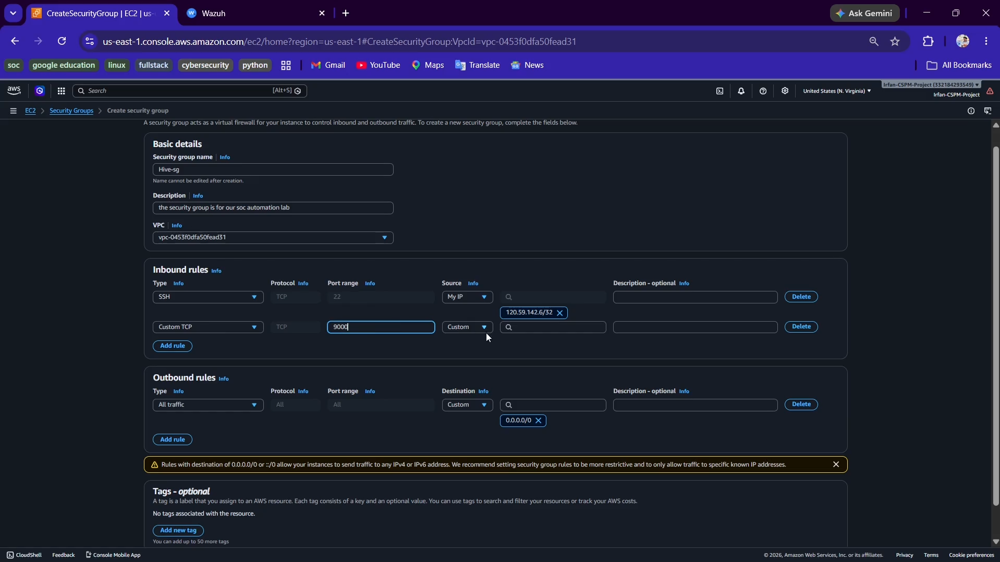

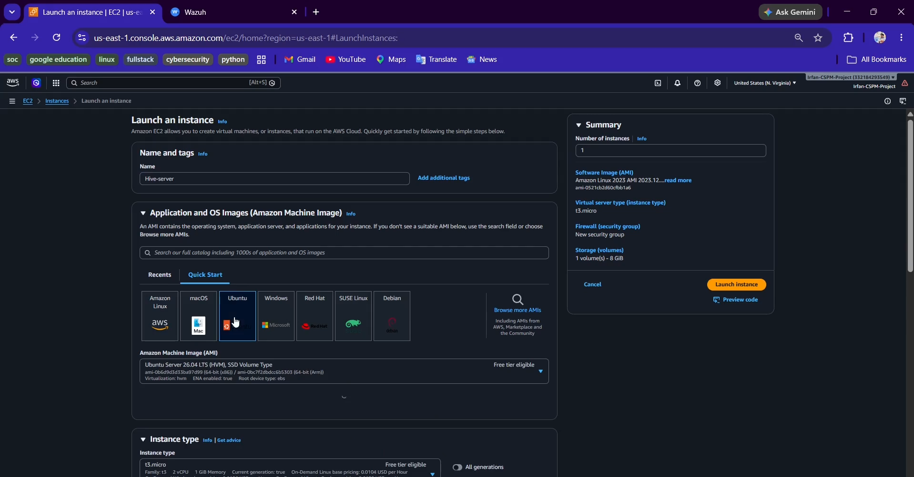

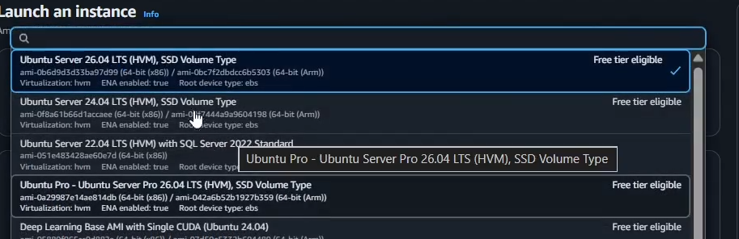


After restarting the instance:

Observed:

systemctl status thehive

Result:

failed

---

Symptoms

TheHive Login Page

Unavailable

Service:

Stopped

---

Investigation

Verified:

Cassandra

Elasticsearch

TheHive

individually.

---

# 61. Service Validation

Commands

systemctl status cassandra

systemctl status elasticsearch

systemctl status thehive

---

Result

Cassandra:

Running

Elasticsearch:

Running

TheHive:

Failed

---

# 62. Recovery

After dependency verification:

Restarted:

systemctl restart thehive

---

Verification

systemctl status thehive

---

Result

active (running)

---

TheHive Login Page became accessible.

---

# 63. Initial TheHive Configuration


Logged in using:

\[admin@thehive.local](mailto:admin@thehive.local)

---

Created Organization

Name:

Irfan-SOC-Automation

---

Created Users

Analyst Account

Service Account

---

Purpose of Service Account

Allow Shuffle to communicate with TheHive.

---

# 64. API Key Generation

Inside Service Account:

Generate API Key

↓

Copy Key

↓

Store Securely

---

This API key would later authenticate Shuffle.

---

# 65. First Integration Attempt

Workflow Updated

Webhook

↓

Regex

↓

VirusTotal

↓

TheHive

---

Action

Create Alert

---

Expected Result

Automatic incident creation.

---

Actual Result

Failed

---

# 66. Error #1

Authentication Failure

Response:

401 Unauthorized

---

Root Cause

Incorrect Authorization Configuration.

---

Fix

Authorization Header:

Authorization: Bearer API_KEY

---

Verification

curl test executed directly on TheHive server.

Result:

Success.

---

# 67. Error #2

Invalid JSON

Response:

400 Bad Request

---

Observed Message

Invalid json

JsResultException

---

This became the longest troubleshooting phase of the project.

---

# 68. Isolating the Problem

To determine whether:

Shuffle

or

TheHive

was responsible,

manual API testing was performed.

---

Direct Test

curl -X POST http://localhost:9000/api/v1/alert

-H "Authorization: Bearer API_KEY"

-H "Content-Type: application/json"

-d '{

"title":"Test Alert",

"description":"Testing",

"type":"internal",

"source":"Wazuh",

"sourceRef":"100002",

"severity":2,

"tlp":2,

"pap":2

}'

---

Result

Success

Alert Created

---

Conclusion

TheHive was working correctly.

Problem existed inside Shuffle request formatting.

---

# 69. Error #3

sourceRef Validation Failure

Returned:

error.expected.jsstring

Path:

.sourceRef

---

Root Cause

Numeric value passed.

Incorrect:

"sourceRef":100002

---

Expected

String value

Correct:

"sourceRef":"100002"

---

After correction:

New error appeared.

---

# 70. Error #4

Duplicate Alert

Returned:

Alert already exists

---

Message

Alert internal:Wazuh:100002 already exists

---

Root Cause

TheHive uses:

source + sourceRef

as a unique identifier.

---

Every execution reused:

100002

---

Therefore:

TheHive rejected duplicates.

---

# 71. Final Solution

Instead of:

100002

Use:

Wazuh Alert ID

Example:

1781859310.1424611

---

This guarantees uniqueness.

---

# 72. Final Successful Execution

Workflow Executed

↓

VirusTotal Queried

↓

TheHive API Called

↓

Alert Created

---

Response

HTTP Status:

201

---

Meaning

Resource Created Successfully

---

The alert immediately appeared inside:

TheHive Dashboard

↓

Alerts

---

# 73. Automated SOC Workflow Completed


Final Workflow

Windows 11

↓

Sysmon

↓

Wazuh Agent

↓

Wazuh Manager

↓

Custom Rule 100002

↓

Shuffle Webhook

↓

Regex SHA256 Extraction

↓

VirusTotal

↓

TheHive

↓

Email Notification

---

# 74. Key Lessons Learned

1. API troubleshooting should always start with direct curl testing.

2. Validate every integration independently.

3. TheHive sourceRef must be unique.

4. HTTP 400 does not always indicate server failure.

5. Authentication issues and payload issues are separate problems.

6. Always inspect raw API responses.

7. A working manual API call proves the server is healthy.

8. Workflow automation requires validating every step individually.

---

By the end of this phase, the SOC environment was capable of detecting malicious activity, enriching indicators with threat intelligence, automatically generating incident tickets, and preparing notifications for analysts without human intervention.


