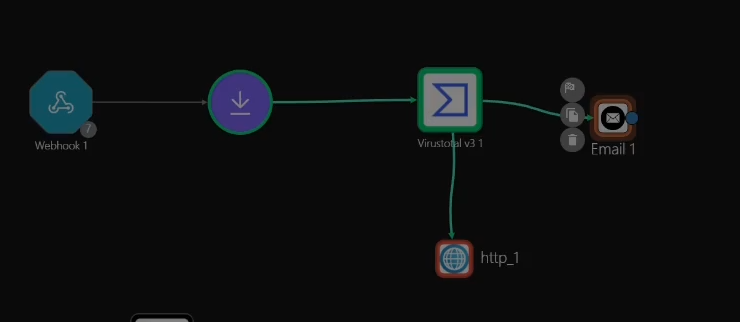
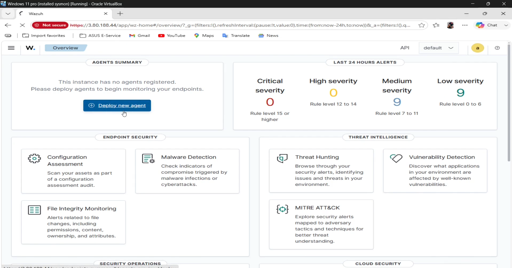
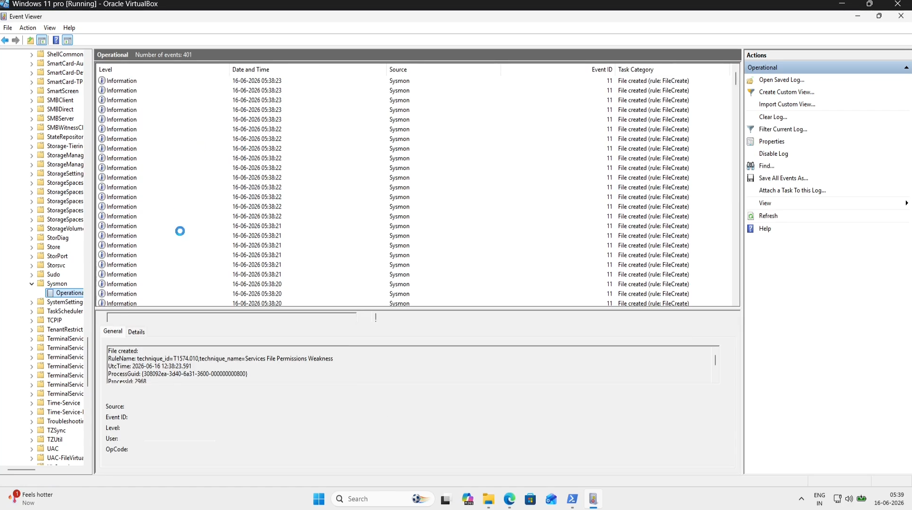
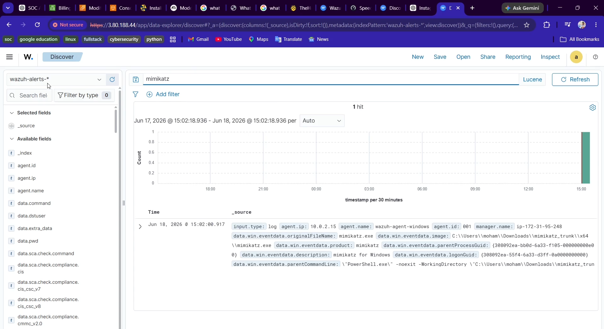
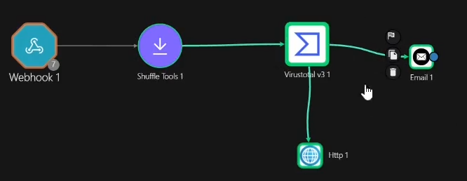
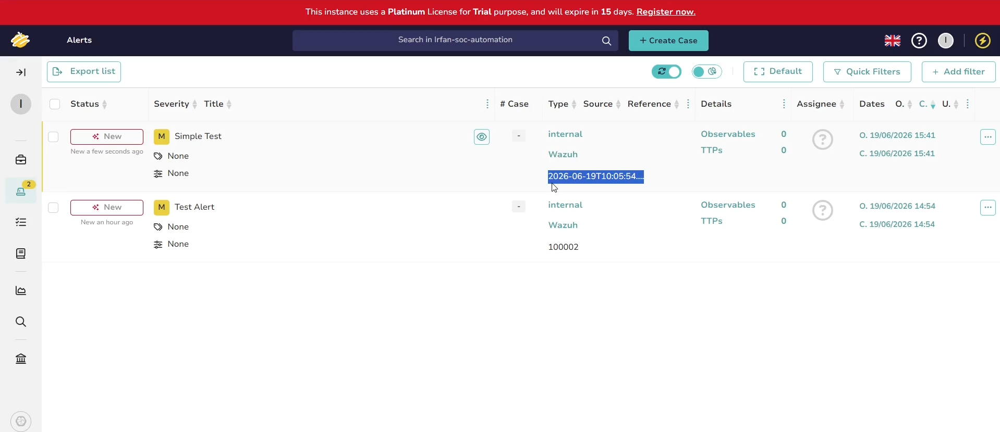

# SOC Automation Lab

## End-to-End Detection, Threat Enrichment, and Automated Incident Response Using Wazuh, Sysmon, Shuffle SOAR, VirusTotal, and TheHive



---

# Overview

This project demonstrates the design and deployment of a complete Security Operations Center (SOC) automation environment capable of:

* Collecting endpoint telemetry

* Detecting malicious activity

* Enriching indicators with threat intelligence

* Automatically generating incident tickets

* Notifying analysts

The environment was built using open-source technologies and AWS cloud infrastructure to simulate a real-world blue-team workflow.

---

# Project Objectives

The primary goals of this project were:

✅ Deploy a SIEM platform

✅ Collect Windows endpoint telemetry

✅ Configure Sysmon logging

✅ Create custom detection rules

✅ Detect Mimikatz execution

✅ Automate alert forwarding

✅ Enrich indicators using VirusTotal

✅ Automatically create incidents in TheHive

✅ Demonstrate an end-to-end SOC workflow

---

# Architecture

```text

Windows 11 Endpoint

        │

        ▼

      Sysmon

        │

        ▼

    Wazuh Agent

        │

        ▼

   Wazuh Manager

        │

        ▼

 Custom Rule 100002

        │

        ▼

   Shuffle SOAR

        │

        ▼

    VirusTotal

        │

        ▼

      TheHive

        │

        ▼

 Analyst Notification

```

---

# Technologies Used

## Endpoint Monitoring

* Windows 11

* Sysmon

* Wazuh Agent

---

## SIEM

* Wazuh Manager

* Wazuh Indexer

* Wazuh Dashboard

---

## SOAR

* Shuffle

---

## Threat Intelligence

* VirusTotal

---

## Incident Response

* TheHive

---

## Cloud Infrastructure

* AWS EC2

* Ubuntu Server 24.04 LTS

---

# Infrastructure

## Wazuh Server

| Component     | Value          |

| ------------- | -------------- |

| OS            | Ubuntu 24.04   |

| Platform      | AWS EC2        |

| Instance Type | m7i-flex.large |

| Purpose       | SIEM           |

---

## TheHive Server

| Component     | Value             |

| ------------- | ----------------- |

| OS            | Ubuntu 24.04      |

| Platform      | AWS EC2           |

| Instance Type | m7i-flex.large    |

| Purpose       | Incident Response |

---

## Endpoint

| Component | Value             |

| --------- | ----------------- |

| OS        | Windows 11        |

| Platform  | VirtualBox        |

| Purpose   | Attack Simulation |

---

# Detection Engineering

## Custom Rule

Rule ID:

100002

Purpose:

Detect Mimikatz execution using Sysmon Process Creation events.

MITRE ATT&CK:

T1003 – Credential Dumping

---

## Detection Logic

```xml

<rule id="100002" level="15">

  <if_group>sysmon_event1</if_group>

  <field name="win.eventdata.originalFileName"

         type="pcre2">

         (?i)mimikatz\.exe

  </field>

  <description>

      Mimikatz usage detected

  </description>

  <mitre>

      <id>T1003</id>

  </mitre>

</rule>

```

---

# Workflow Automation

## Shuffle Workflow

```text

Webhook

   │

   ▼

Regex Extraction

   │

   ▼

VirusTotal

   │

   ▼

TheHive

   │

   ▼

Email Notification

```

---

# Detection Workflow

### Step 1

Execute:

mimikatz.exe

on Windows 11 endpoint

---

### Step 2

Sysmon generates:

Event ID 1

Process Creation

---

### Step 3

Wazuh Agent forwards telemetry

---

### Step 4

Wazuh Manager evaluates custom rule

---

### Step 5

Rule 100002 triggers

---

### Step 6

Alert forwarded to Shuffle

---

### Step 7

SHA256 extracted using Regex

---

### Step 8

VirusTotal queried automatically

---

### Step 9

TheHive alert generated

---

### Step 10

Analyst notified

---

# Screenshots

## Wazuh Dashboard



---

## Sysmon Telemetry



---

## Mimikatz Detection



---

## Shuffle Workflow


---

## VirusTotal Enrichment



---

## TheHive Alert



---

# Project Outcomes

Successfully demonstrated:

* Endpoint Telemetry Collection

* Detection Engineering

* Threat Hunting Concepts

* Threat Intelligence Enrichment

* Security Automation

* Incident Response Automation

* API Integration

* Cloud-Based SIEM Deployment

---

# Challenges Encountered

Major troubleshooting activities included:

* Sysmon telemetry collection failures

* Wazuh dashboard issues

* AWS public IP changes

* Agent connectivity problems

* TheHive startup failures

* API authentication failures

* Invalid JSON payloads

* Duplicate alert creation errors

Complete details are documented in:

\[TROUBLESHOOTING.md](TROUBLESHOOTING.md)

---

# Documentation

Detailed deployment steps:

📄 BUILD_LOG.md

Detailed troubleshooting:

📄 TROUBLESHOOTING.md

---

# Skills Demonstrated

## Blue Team

* Security Monitoring

* Incident Detection

* Threat Analysis

---

## Detection Engineering

* Sysmon Configuration

* Custom Wazuh Rules

* MITRE ATT&CK Mapping

---

## SIEM Engineering

* Wazuh Deployment

* Log Collection

* Event Analysis

---

## SOAR

* Workflow Automation

* Alert Orchestration

* API Integration

---

## Cloud Security

* AWS EC2

* Security Groups

* Remote Administration

---

# Future Improvements

* Integrate Slack notifications

* Integrate Microsoft Teams

* Add Sigma Rules

* Add YARA-based detections

* Add Suricata IDS telemetry

* Deploy Shuffle self-hosted

* Implement automated containment

* Integrate Cortex analyzers

---

# Author

Mohamed Irfan

Cybersecurity | SOC Analyst | Detection Engineering | SIEM | SOAR

LinkedIn: https://www.linkedin.com/in/mohamedirfans/
---

⭐ If you found this project useful, consider starring the repository.

